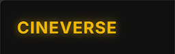
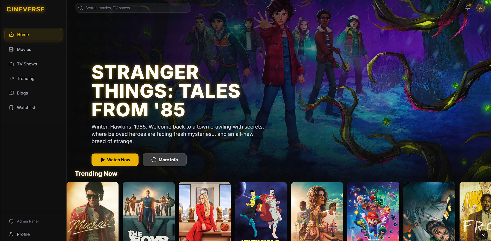
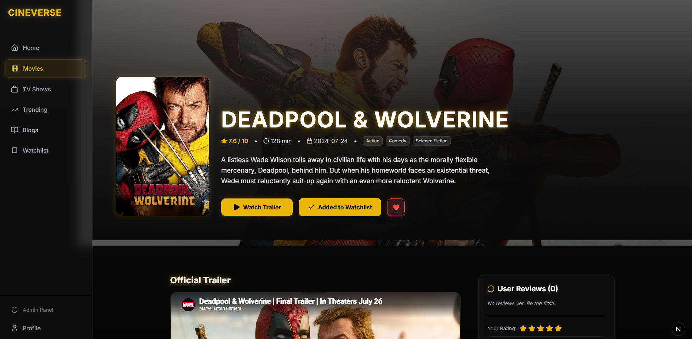
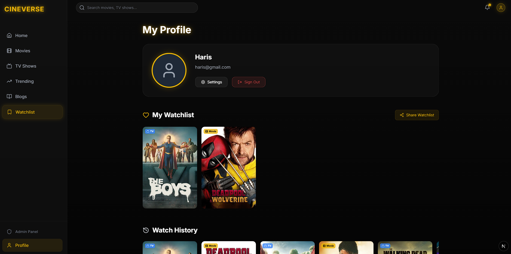
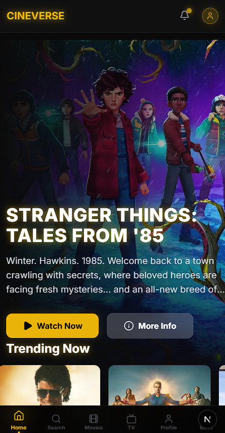

# CineVerse Intelligence Platform 🦇



CineVerse is a modern, SaaS-driven entertainment platform that combines cinematic content discovery with a powerful analytics engine. Built with performance, scalability, and user experience in mind, it delivers an app-like interface on the web with real-time data insights, immersive UI, and a structured content ecosystem.

---

## 🚀 Live Demo
👉 https://cineverse-seven-five.vercel.app/

---

## ✨ Key Features

### 🎬 Cinematic Experience
- **Immersive Mode**: Detail pages automatically hide navigation for a distraction-free viewing experience.
- **Dynamic Poster Glow**: Extracts dominant colors from posters to create ambient UI lighting.
- **Where to Watch**: Displays streaming providers (Netflix, etc.) using TMDB + JustWatch integration.

---

### ⚡ Performance & Data
- **SWR Data Fetching**: Fast, cached, and optimized API-based architecture.
- **Optimistic UI**: Instant updates for Watchlist, Favorites, and user actions.
- **Edge Caching + ISR**: High-performance delivery using CDN and revalidation strategies.

---

### 🧠 Intelligence & Analytics (Admin)
- **Engagement Tracking**: Monitor clicks, favorites, and watch activity.
- **Content Insights**: Identify trending and high-performing titles.
- **User Analytics**: Track DAU/WAU and user behavior patterns.
- **Content Control Panel**: Pin, hide, and manage platform-wide content.

---

### 📱 Mobile-First UX
- **Bottom Navigation**: Native-style tab bar for mobile devices.
- **Gesture Navigation**: Swipe between main sections.
- **Smooth Transitions**: App-like animations using Framer Motion.
- **Responsive Design**: Optimized for all screen sizes.

---

### ✍️ Content Ecosystem (SEO)
- **Blog System**: Articles for movies, TV, and entertainment news.
- **Categories**: Reviews, Guides, Analysis, News.
- **Internal Linking**: Connects blogs with movie/TV pages.
- **SEO Optimization**:
  - Dynamic metadata
  - JSON-LD schema (Movie, Article, Breadcrumb)

---

### 🔥 Core Platform Features
- **Watchlist, Favorites, History**
- **Public Shared Watchlists**
- **Interactive Cast Pages (Actor Profiles)**
- **Movie + TV Smart Routing**
- **Unified Search (Movies + TV)**

---

## 🛠 Tech Stack

### Frontend
- Next.js 16 (App Router)
- React 19
- Tailwind CSS + Custom UI System
- Framer Motion (animations)

### Backend & Architecture
- Next.js API Routes (Edge + Node)
- Firebase Admin SDK (secure backend logic)
- Middleware / Proxy (auth + rate limiting)

### Database & Auth
- Firebase Authentication
- Google Cloud Firestore (NoSQL)

### Data & APIs
- TMDB API (Movies & TV)
- GNews API (Blogs / News)
- JustWatch (via TMDB providers)

### Performance
- SWR (Stale-While-Revalidate)
- ISR (Incremental Static Regeneration)
- CDN Edge Caching

---

## 📸 Screenshots

| Homepage | Movie Details |
| :---: | :---: |
|  |  |

| Profile Dashboard | Mobile View |
| :---: | :---: |
|  |  |

---

## 💻 Running Locally

### Prerequisites
- Node.js 18+
- Firebase Project (Auth + Firestore)
- TMDB API Key
- GNews API Key

---

### Installation

1. Clone the repository:
```bash
git clone https://github.com/JustHaris/cineverse.git
cd cineverse
